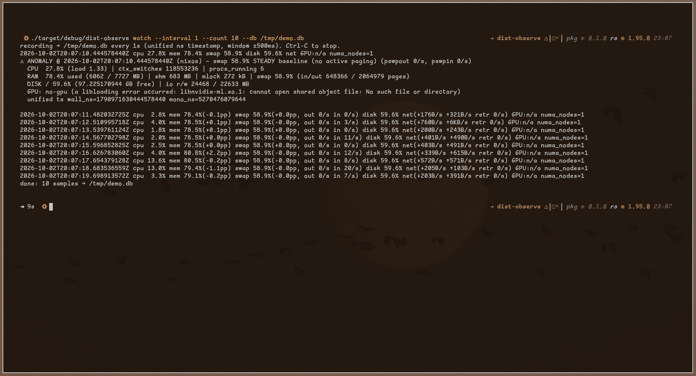

# dist-observe



Unified timestamp observability for your fleet
It does not just tell you that something broke
It shows why with every layer correlated to the same nanosecond
Lower MTTR and fewer 3AM mysteries

## Install

```bash
cargo build
sudo bash scripts/install.sh
sudo systemctl enable --now dist-observe-collector
sudo systemctl enable --now dist-observe-agent@web-1
```

## Why you would run it

- Catch mem leaks and pinpoint heap versus native FFI blind spot growth
- Get paged hours before disk or RAM exhaustion instead of after the OOM killer strikes
- Separate real net issues such as retransmits from local pressure in disguise
- Settle worker divergence between benign FP variance and a genuine race
- Filter neighbor noise on shared hosts and alert on your problems only with full fidelity logs retained for postmortems

## Core CLI

```bash
dist-observe record --count 10 --db observedb   # collect samples into SQLite for later analysis
dist-observe watch --count 10 --db observedb    # live view with explained anomalies
dist-observe predict --db observedb             # trend based exhaustion forecast with no static thresholds
dist-observe show --db observedb --limit 3      # dump recent snapshots as JSON
```
